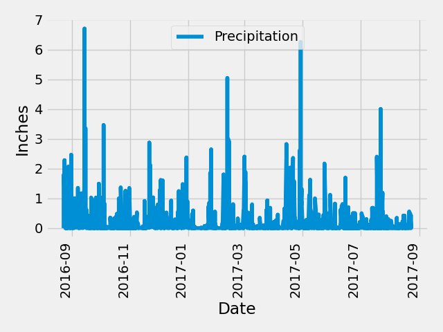
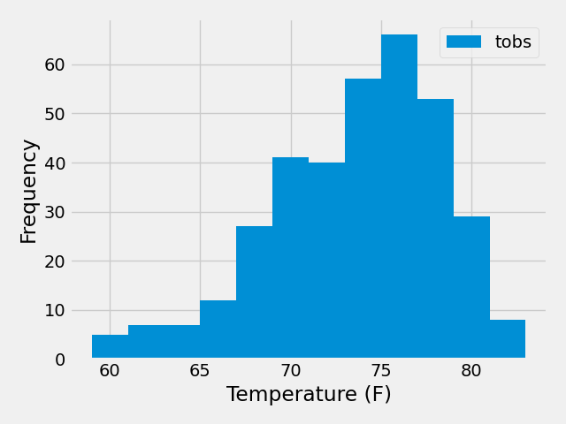

# sqlalchemy_climate
Climate Analysis

This repository contains one subdirectory called 'SurfsUp'. This subdirectory contains a Jupyter notebook called climate_starter.ipynb as well as a python application called app.py. 

## Jupyter Notebook
The Jupyter Notebook performs the following tasks:
- Using SQLAlchemy, connects to a SQLite databse stored in the 'Resources' subdirectory and uses reflection to replicate the data
- Links python to the database
- Analyzes rainfall statistics for Hawaii from nine separate weather stations
- Plots the rainfall across the different weather stations by date for the most recent year of data
- Analyizes temperature measurements for hte most recent year of data for the weather station that contained the most data
- Provides min, max, and average temps
- Plots a histogram of temperatures

## app.py
The Python file cintains a Flask microsite that can be used as an API to collect portions of hte dataset It contains paths for:
- The "home" site that lists the various paths
- An API that retrieves the most recent 12 months of rainfall data by date (called "precipitation")
- An API that retrieves the information on the various weather stations (called "stations")
- An API that retrieves the most recent year of data from the most active weather station (called "tobs")
- An API that retrieves the min, avg, and max temperatures from the most active weather station from the date specified by the user up to the most recent date (called "start")
- An API that retrieves the min, avg, and max temperatures from the most active weather station for the date range specified (called "start/end")

## Date format
Note that for the last two API's, the expected date format is 'YYYY-MM-DD'. If specifying both start end end dates, the start and end dates should be separated with a forwards slash ('/').

### Note
StackOverflow was used for references purposes and problem solving as well as the course materials, but all code is mine.
